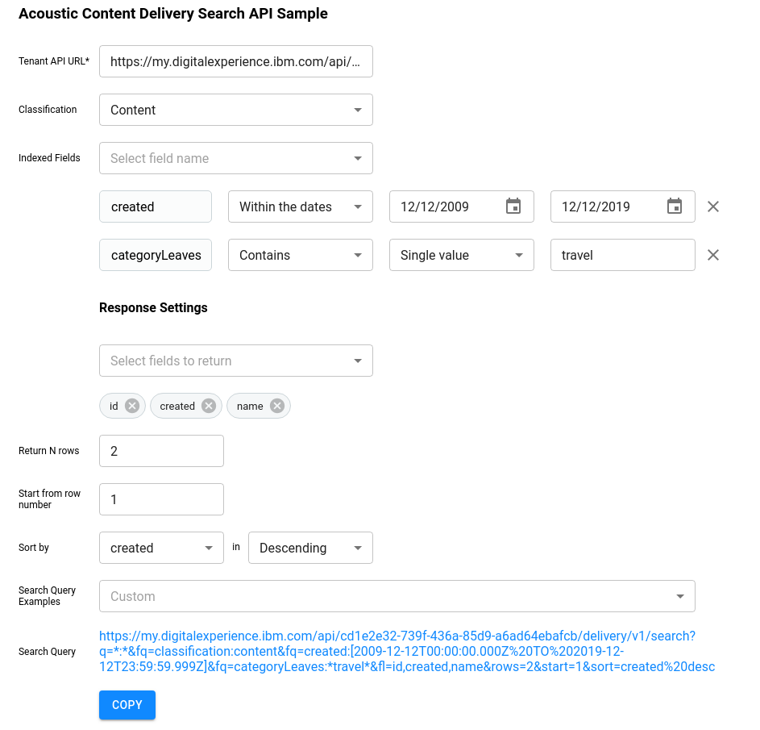

# Acoustic Content Delivery Search API Sample

This sample shows some of the capabilities of Acoustic Content
search services. This is a technical sample intended for developers exploring
the Acoustic Content APIs and data model.

## Prerequisites

#### 1. Download the files and install Node modules

To run this sample locally you need to have [Node.js](https://nodejs.org)
installed on your system. Download the project files into any folder on your
workstation and within that folder run

`npm install`

to install the dependencies and then

`npm start`

to start a dev server. This will also open `localhost:3000` in your default
browser with the sample running.

#### 2. Enable CORS support for your tenant

To use the client JavaScript implementation of this sample you will need to
enable CORS support for your tenant. To control the CORS enablement for Acoustic Content, 
go to Hub set up -> General settings -> Security tab. After adding
your domain (or "\*" for any domain), be sure to click the Save button at the top
right of the screen.

## Exploring the sample and the Acoustic Content search API capabilities

The Acoustic Content search service is built on the powerful SOLR search engine, and the
search parameters offer a great number of useful features for searching and
controlling the returned search results. In this sample you can select from a
list of example search queries to try them out and to see the search parameters
that are used. You can also edit the search parameters input to try your own
search queries. Changes made to inputs reflect immediately in the search link
at the bottom. The link can either be copied to the clipboard with the `Copy`
button or clicked directly.



When clicked a new browser tab is opened showing the search results. At the top
you can see how many rows were found. This is often different than the number of
result entries, which is controlled with the "rows" parameter.


The example queries in the drop-down list show a number of useful queries,
shown in this screenshot.


There exist 3 types of controls to change the search parameters' values. The
text input allows to enter values manually and choose options which should be
applied to them.


It also allows searching for multiple values. In this case the values should be
separated with commas.


The date input is used to either set a past or future date


or to type them in manually or with the help of the date pickers.


The dropdown is used to pick one of the pre-defined values.


Which fields to return is controlled with `Select fields to return dropdown`.
A field can be included to or excluded from the result by toggling the
appropriate checkbox. It can also be excluded by clicking the delete button on
its chip below. `All` option is used to include all of the fields to the
response.


The controls for changing the number of return rows, their offset, the field to
sort on and the sorting order are self descriptive.

General documentation for SOLR queries can be found at https://lucene.apache.org/solr/guide/6_6/searching.html

#### Selecting fields to return in results and using the "document" field

One of the parameters for search is the "fl" parameter for selecting which fields are returned for each entry. In the sample, most of the example queries use the following list of fields:
&fl=name,document,id,classification,type,status

The "document" field includes the complete referenced document, for example the complete content item or the complete asset JSON. By default it is returned as single string that you would need to parse as JSON. You can also add the ":[json]" option to have the document field automatically parsed as JSON, as in this example:
&fl=name,document:[json]

#### Search parameters used in the example queries

Here are some of the parameters used in the example queries:

- **q** specifies the search term (query) in field:value format, for example q=\*:\* specifies a wildcard query matching all fields and values
- **fl** selects the set of fields to include in the results, for example &fl=name,document:[json] or &fl=\* (all fields)
- **rows** specifies how many result entries to return, for example rows=20 (default == 10)
- **start** specifies the starting entry number to return, for example start=20 (default == 0)
- **sort** specifies a field to sort on, with asc or desc for ascending/descending, for example sort=lastModified%20desc

- **fq (filter queries)** further restrict the superset of query results returned from the primary query as described here: https://lucene.apache.org/solr/guide/6_6/common-query-parameters.html#CommonQueryParameters-Thefq_FilterQuery_Parameter
- **fq=classification:** selects what kind(s) of artifacts to search for (eg, asset, type, content), for example to search for assets only, use fq=classification:asset
- **fq=type:** searches for an item using a particular content type, for example fq=type:Article
- **fq=status:** searches for artifacts matching draft/ready/retired status, for example fq=status:draft
- **fq=tags:** searches for one or more tags, for example fq=tags:(beach OR summer)
- **fq=categoryLeaves:** searches for category values, for example fq=categoryLeaves:(travel OR auto)
- **fq=classification:(category)&fq=path:(\\/Sample\ Article\\/\*)** search for categories under a taxonomy named "Sample Article"

#### Search content by element

The delivery search example shows how to search for content by the value of a particular element. The examples show searching for Products by a ProductId and searching for Events by the event date. In order for the Product examples to show results, a "Product" content type needs to exist in the target tenancy, containing an element named "ProductId" that is configured to have a search key of "string1". In order for the Event example to show results, an "Event" content type needs to exist in the target tenancy, containing an element named "EventDate" that is configured to have a search key of "sortableDate1".

#### Search for categories under a given taxonomy

To search for categories under a given taxonomy, you can use a path query with wildcards. For example, to search for all categories under a "Sample Article" taxonomy, you can use a query like the following (where backslash is used to escape the forward slashes and the space in the path value, and where backslash itself may need to be url encoded as %5C in the actual URL sent to the service):

```
  q=*:*&fl=id,name&fq=classification:(category)&fq=path:(\/Sample\ Article\/*)
```

See the following Solr documentation for more information on escaping characters in queries: https://lucene.apache.org/solr/guide/6_6/the-standard-query-parser.html#the-standard-query-parser

## Deployment to Acoustic Content

1. Get **Delivery URL** from **Acoustic Content information**


2. In **package.json** change **homepage** value to **Delivery URL**/samples/search-api-sample

   ```
   "homepage": "{Tenant Delivery URL}/samples/search-api-sample”,
   ```

3. Run **npm run hub-build-deploy** to build app and deploy to Acoustic Content. There is also a shortcut for building and deploying in one step via npm run build-deploy. Note that publishing can take up to 20 minutes for all updates to be available. In case you do not want to wait for the server side akamai cache to time out you can flush the cache via: **wchtools clear --cache** More information can be found here: [Clearing the content delivery network cache](https://github.com/acoustic-content-samples/wchtools-cli#clearing-the-watson-content-hub-content-delivery-network-cache)

The sample can then be accessed with the following URL, using the Delivery URL from Hub Information:

   ```
   {Delivery URL}/samples/search-api-sample/index.html
   ```
